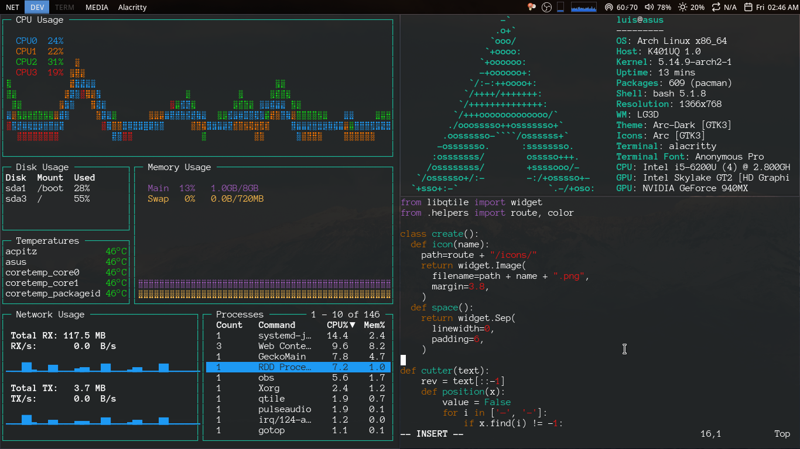

# Arch
### Configuración

1. [instalar Arch Linux](https://wiki.archlinux.org) 
2. configuracion de sudo ``/etc/sudoers``
```
# añadimos la siguiente linea al alchivo
usuario ALL=(ALL) ALL
```


3. inicia session con su usuario
4. configuracion del escritorio
```
# clonar el repositorio
# usar el comando
$ sh install.sh
```

* [GRUB - THEME](./grub/)

---
### Capturas de pantalla
